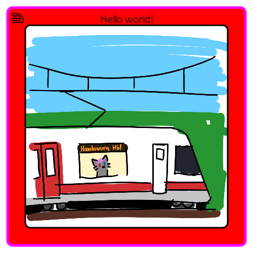

# Badger

**Badger is currently in beta. For the latest version, check the [releases](https://github.com/FoxSamu/badger/releases).
**

Badger is a system for generating images out of templates and supplied data. It was written for
[Reffurence](https://github.com/Reffurence) to generate convention badges.

The core idea of Badger is to be a highly configurable HTTP server whose endpoints serve
dynamically generated images, which are built up from simple layers, such as a static image,
text, or a shape.

Badger allows generating individual images, as well as generating multiple in a batch. The
resulting outputs can be zipped or written to a PDF.

# Running

You can compile and run Badger from the source code simply with `./gradlew run`
(permission denied? &rightarrow; `chmod +x gradlew`).
This will run the server configured with `example_config.yml` as configuration file.
You can test if the server is up by going to http://localhost/. You should see a message
that looks something like this:

```
-- Badger --
Hi I am Badger server v<version>
```

## Docker

To build Badger into a Docker image, you can run `./gradlew buildDockerImage`. Make sure
the Docker engine is running before running the Gradle task. The task will build an image
tagged `net.foxboi/badger:<version>` (it will print the build version in the console).

You can then run the built image as follows:

```
docker run -p 80:80 net.foxboi/badger:<version>
```

Or you can use Docker Compose to run the image:

```yaml
services:
  badger:
    image: net.foxboi/badger:<version>
    ports:
      - "80:80"
    # ...further configuration...
```

# Usage

**Are you developing an application that uses
Badger? [Read more about how to make HTTP requests to Badger.](docs/requests.md)**

Badger generates images from templates. These templates are built up from layers. For
example, this template:

```yaml
size: [ 200, 200 ]
layers:
  - !<rect>
    rect: [ 0%, 0%, 100%, 100% ]
    color: (#FFF)
  - !<rect>
    rect: [ 20px, 25%, 100% - 40px, 50% ]
    color: (#F00)
```

...will generate the following image of a red rectangle on a white background:


Badger can currently draw rectangles, images, SVGs and text. Check out the
[documentation](docs/basics.md) (heavy WIP) to learn more about how Badger can be
configured and programmed, or check out the [example assets](examples) or [example
configuration](example_config.yml).

When running Badger using `./gradlew run`, it will load the example config and example
assets, and you can go to http://localhost/template to get the following image:



The template of this can be found at [examples/template.yml](examples/template.yml).

# Problems? Missing features?

### [Report an Issue](https://github.com/FoxSamu/badger/issues/new)

# License

**This software is licensed under the MIT license.**

Copyright &copy; 2025 O.W. Nankman (Sam&umacr;)

Permission is hereby granted, free of charge, to any person obtaining a copy of this software and associated
documentation files (the “Software”), to deal in the Software without restriction, including without limitation the
rights to use, copy, modify, merge, publish, distribute, sublicense, and/or sell copies of the Software, and to permit
persons to whom the Software is furnished to do so, subject to the following conditions:

The above copyright notice and this permission notice shall be included in all copies or substantial portions of the
Software.

THE SOFTWARE IS PROVIDED “AS IS”, WITHOUT WARRANTY OF ANY KIND, EXPRESS OR IMPLIED, INCLUDING BUT NOT LIMITED TO THE
WARRANTIES OF MERCHANTABILITY, FITNESS FOR A PARTICULAR PURPOSE AND NONINFRINGEMENT. IN NO EVENT SHALL THE AUTHORS OR
COPYRIGHT HOLDERS BE LIABLE FOR ANY CLAIM, DAMAGES OR OTHER LIABILITY, WHETHER IN AN ACTION OF CONTRACT, TORT OR
OTHERWISE, ARISING FROM, OUT OF OR IN CONNECTION WITH THE SOFTWARE OR THE USE OR OTHER DEALINGS IN THE SOFTWARE.

